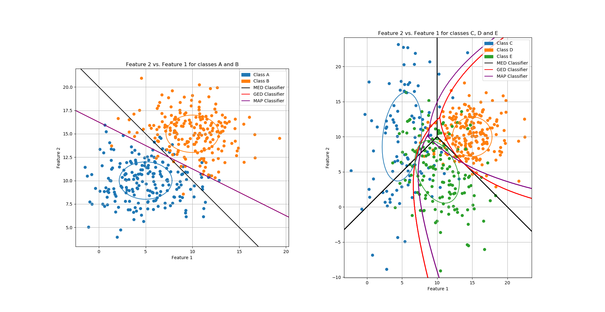
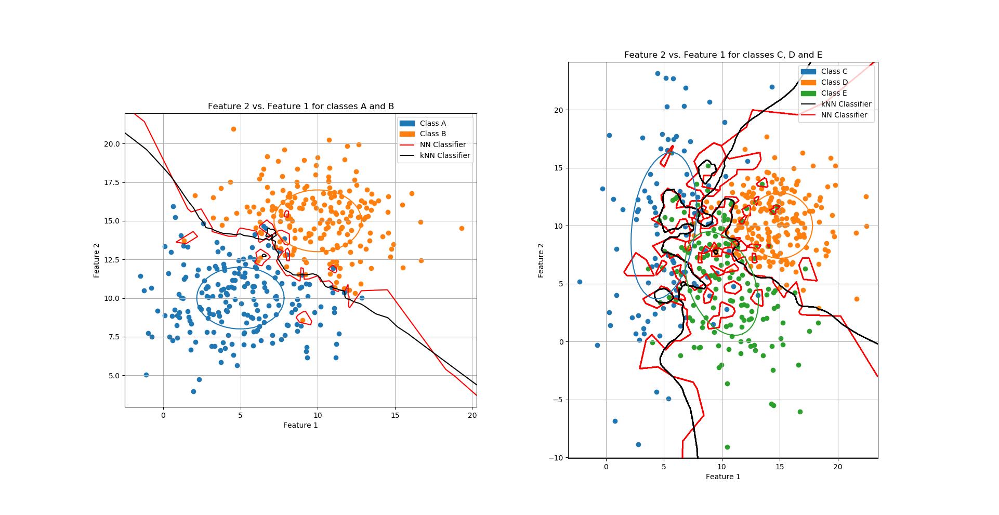

# Clusters and Classifiers

This repository contains the source code for cluster generation and classification of five classes with bivariate Gaussian distribution parameters. Classification was implemented using MED, GED, MAP, NN, and kNN classifiers. Error analysis was conducted by determining the experimental error rate and confusion matrix for each classifier.  

## Cluster Generation
Normal distributions for the following classes were created using `numpy.random.multivariate_normal`. Distribution plotting was implemented with `plot` and `scatter` from `matplotlib.pyplot`, and standard deviation contours for each class were plotted using `contour` from the same module. Code: [data_class.py](data_class.py)  
  
Class A: NA = 200, μA = [5 10]T,  ΣA = [ [8 0], [0 4] ]  
Class B: NB = 200, μB = [10 15]T,  ΣB = [ [8 0], [0 4] ]  
  
Class C: NC = 100, μC = [5 10]T,  ΣC = [ [8 4], [4 40] ]  
Class D: ND = 200, μD = [15 10]T,  ΣD = [ [8 0], [0 8] ]  
Class E: NE = 150, μD = [10 5]T,  ΣE = [ [10 -5], [-5 20] ]  

## Classifiers
The following classifiers were implemented:  
1. Minimum Euclidean Distance (MED)
2. Generalized Euclidean Distance (GED)
3. Maximum A Posterioi (MAP)
4. Nearest Neighbor (NN)
5. k-Nearest Neighbor (kNN) with k = 5  
  
To classify, a 2D grid was created, each point was classified, and a contour plot was generated. Code: [classifiers.py](classifiers.py)  
  
## Error Analysis
Following classification, the experimental error rate and confusion matrices were determined for each classifier. This was implemented using `accuracy_score` and `confusion_matrix` from `sklearn.metrics`. Code: [error_calculation.py](error_calculation.py)
